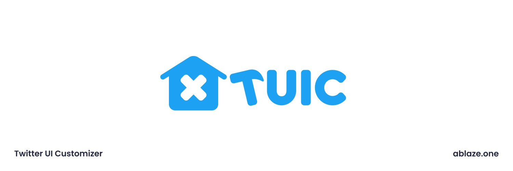

# Twitter-UI-Customizer

Firefox Browser ADD-ONS  
→https://addons.mozilla.org/ja/firefox/addon/twitter-ui-customizer/  
Chrome WebStore  
→https://chrome.google.com/webstore/detail/twitter-ui-customizer/hpmhdmlhnppmmipefebkhkbpdcjiidmh?hl=ja  
 
情報・設定・CSS集(TwitterのUIの色を公式Twitterに近くすることも出来ます！)→https://github.com/kaonasi-biwa/TUIC-Information-Prefs-and-CSSs/blob/main/README.md  
 
Firefoxの場合は自動で更新してくれるFirefox Browser ADD-ONSがおすすめです！  
Chromiumの場合は、更新の反映が遅いが自動更新してくれるChrome WebStoreか、手動だけどすぐに更新を適用できるGitHubか、お好きな方をお選びください！  
 
デバッグするときは、`manifest.json`に`manifest_chrome.json`か`manifest.firefox`のうち適したものをコピーしてください  
 
## Special Thanks (使い方あってるか知らんけど)
GitHub:
- @GrapeApple0 (クライアント名表示)  
- @irhdevel (すばらしきデザイン)  
- @Taka005 (ソースコードの整理)  
- @Hibi-10000 (アメリカ英語の翻訳者)  
- @KotoneFami (機能追加)  
- @nakasyou (デザインの改良)

Crowdin:
- @loading_yt (中国語の翻訳者)  
- @nyanrus (韓国語の翻訳者)
- @enthropyreg (ロシア語の翻訳者)

その他
- @CutterKnife_ / Twitter  **(アイコン・ロゴの作成者)**

## 実装されている機能
- 「未送信ツイートの編集」「未フォローのフォローボタン」「フォロー中のフォローボタン」「フォロー解除ボタン」「ホバー時のフォローボタン」「ブロック中の人のフォローボタン」「ブロック解除時のフォローボタン」「プロフィール設定」「最終決定(ログアウト時のやつなど)」のボタンについて、それぞれ枠線色・背景色・文字色を設定できる
- ツイートの下にあるボタンの順番をいじれる
- ツイートの下にあるボタンに「ブックマークに追加」「ツイートのリンクをコピー」「引用ツイート」「ユーザーをブロック」「ユーザーをミュート」を追加できる
- リツイートボタンを押したときに、メニューを出さずにリツイートすることができる
- ツイートの下のボタンが横に溢れたときににスクロールバーを表示できる
- サイドバーの並び順を変更できる
- サイドバーに「リスト」「Twitter Circle」「トピック」「Twitterサークル」「トピック」「コミュニティ」「認証済み組織」「下書き」「移動する」「表示」「ミュートとブロック」を追加できる
- サイドバーの縦の間隔が大きくにゃっているときに、それをちっちゃくできる
- サイドバーのスクロールバーを非表示にできる
- Twitterの左上・起動時のアイコンを「デフォルト」「非表示」「犬」「鳥」「カスタムアイコン(画像をアップロードできる)」から選べる
- カスタムアイコンに関しては、丸と四角から選べる
- タイムライン上のおすすめユーザー、Twitter Pro プロモーションボタンを非表示にできる
- 右サイドバーの「認証する」を非表示にすることができる
- ツイートの返信一覧の「もっと見つける」を非表示にすることができる
- ツイートの右上にたまにある「購入する」非表示にすることができる
- プロフィールに偶にあるサブスクリプションボタンを非表示にすることができる
- プロフィールの「ハイライト」タブを消せるようになる
- クライアント情報を表示できる
- カスタムCSSを書くことができる
- (設定のエクスポート/インポートもできる)

## いるかもわからぬ翻訳者の方へ
Crowdinで試験的にやってみています！  
良ければこちらからよろしくお願いします！  
https://crowdin.com/project/twiter-ui-customizer  
  

### Twitter上でのTUICの翻訳
- もとから(ファイルだけでも)用意してある言語は、一番最初の`@JapaneseLanguageName`に、言語名を書いています  
- それぞれのバージョンの追加IDは[addI18nTags.md](./addI18nTags.md)に書いています
- 言語のタグ名はこのGitHubのリポジトリ( https://github.com/fa0311/TwitterInternalAPIDocument/tree/master/docs/json/i18n )のディレクトリ名準拠で、全て小文字でお願いします(ja、en-gbなど)
#### 翻訳の仕方 (目的の言語のファイルがない場合)
1. `i18n/_langList.json`に言語のタグ名を追記する
2. i18nディレクトリに、`<言語タグ名>.json`という名前のファイルを配置する
#### 翻訳の仕方 (目的の言語のファイルがある場合)
1. `i18n/<言語タグ名>`を開く
#### 翻訳の仕方 (共通)
3. `i18n/ja.json`をもとに翻訳する
### ポップアップなどTUIC自体の翻訳
こちらの記事( https://developer.mozilla.org/ja/docs/Mozilla/Add-ons/WebExtensions/Internationalization )と`_locales/ja/messages.json`を参照してください

## アイコン画像の提供元
[System UIcons](https://www.systemuicons.com/)
 - Unlicenseの元で配布されています。
