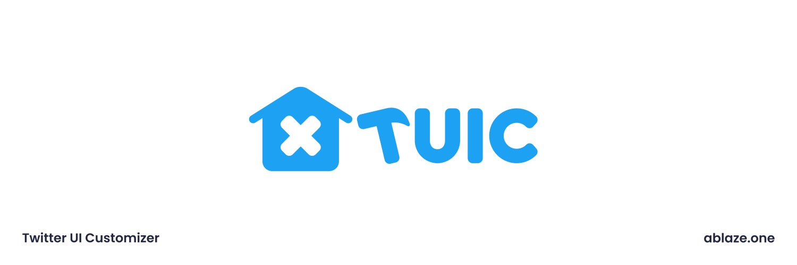

#  Twitter UI Customizer

[English Translation](./README_EN.md)

  

[crxファイルでのインストール方法はこちら](https://gist.github.com/Hibi-10000/54d283e5e5deabc3c491ce16556b4390)  
[情報・設定・CSS集(TwitterのUIの色を公式Twitterに近くすることも出来ます！)](https://github.com/kaonasi-biwa/TUIC-Information-Prefs-and-CSSs/blob/main/README.md)

Firefoxの場合は自動で更新してくれるFirefox Browser ADD-ONSがおすすめです！

Chromiumの場合は、

-   Chrome WebStore：自動更新、更新の反映が遅い
-   zipファイル    ：手動、    すぐに更新を適用できる
-   crxファイル    ：自動更新、初期設定が少し面倒

の中のお好きなものをお選びください！

## 貢献者様へ

詳しくは[CONTRIBUTING.md](./CONTRIBUTING.md)を御覧ください。

**パッケージマネージャーをpnpmに変更しました！**  
yarnを使用していた方は、pnpmをインストールして`node_modules`を削除した上で  
`pnpm i --frozen-lockfile`を実行してください。

**ビルドツール Vite導入により、デバッグ方法が変わりました！**  
ビルド及びデバッグ方法については、[docs/vite_build](./docs/vite_build.md)を御覧ください。  
この変更は2023年9月2日からの適用です。

## 実装されている機能

### ツイート
- 枠線色・背景色・文字色の設定
  - 「未送信ツイートの編集」「未フォローのフォローボタン」「フォロー中のフォローボタン」「フォロー解除ボタン」「ホバー時のフォローボタン」「ブロック中の人のフォローボタン」「ブロック解除時のフォローボタン」「プロフィール設定」「最終決定(ログアウト時のやつなど)」のボタン
-   ツイートの返信一覧の「もっと見つける」を非表示にすることができる
-   ツイートの右上にたまにある「購入する」非表示にすることができる
- 下にあるボタン
  - 順番をいじれる
  - 「ブックマークに追加」「ツイートのリンクをコピー」「引用ツイート」「ユーザーをブロック」「ユーザーをミュート」「ツイートを削除」「いいねとRT」「DMで送信」の追加できる
  - 「ツイートを削除」「ユーザーをブロック」をツイート下ボタンからするときに、モーダルを出さずにできる
  - 横に溢れたときににスクロールバーを表示できる
-   リツイートボタンを押したときに、メニューを出さずにリツイートすることができる
### サイドバー
- 並び順を変更できる
- 「トピック」「下書き」「移動する」「表示」「ミュートとブロック」を追加できる
- 縦の間隔が大きくにゃっているときに、それをちっちゃくできる
- スクロールバーを非表示にできる
- 右サイドバーの「検索バー」「認証する」「どうしてる？」「進行中のスペースを聞く」「おすすめユーザー」「リンク集」を非表示にできる
### アイコン 
- Twitterの左上・起動時のアイコンを「デフォルト」「非表示」「犬」「鳥」「X」「カスタムアイコン(画像をアップロードできる)」から選べる
- カスタムアイコンのみ、丸と四角から選べる
- faviconを変更することもできる
- Twitterアイコン・Xアイコンは色も変更することができる
### タイムライン
- おすすめユーザー、Twitter Pro プロモーションボタンを非表示にできる
- タイムラインのリツイートを非表示にできる
### 他
-   画面右下のメッセージを非表示を非表示にできる
-   プロフィールに偶にあるサブスクリプションボタンを非表示にすることができる
-   プロフィールの「ハイライト」タブを消せるようになる
-   カスタムCSSを書くことができる
-   (設定のエクスポート/インポートもできる)

## Special Thanks (使い方あってるか知らんけど)

GitHub:

-   @irhdevel (すばらしきデザイン)
-   @GrapeApple0 (クライアント名表示)
-   @Taka005 (ソースコードの整理)
-   @Hibi-10000 (アメリカ英語の翻訳・CRXリリース)
-   @KotoneFami (機能追加やソースコードの整理など)
-   @nakasyou (デザインの改良・機能追加)
-   @surapunoyousei (デバッグしやすく)
-   @typeling1578 (リファクタリング)
-   @regularenthropy (リファクタリング・パフォーマンス向上)
-   @GreenDotBlue99 (タブの固定機能)
-   @nyanrus (設定画面の改良＆リファクタリング)

Crowdin:

-   @nyanrus (韓国語と英語の翻訳)
-   @loading_yt (簡体中国語と繁体中国語の翻訳)
-   @hibi_10000 (英語の翻訳)
-   @enthropyreg (ロシア語とウクライナ語の翻訳)
-   @teamolhuang (繁体中国語の翻訳)
-   @rosalindsun12 (簡体中国語の翻訳)
-   @truselya (ロシア語の翻訳)
-   @gok7ug (トルコ語の翻訳)
-   @saturnsoot (ドイツ語の翻訳)
-   @yanniekwok314 (繁体中国語の翻訳)
-   @lafixier (英語の翻訳)
-   @cutterknife (英語の翻訳)
-   @deflecta (ロシア語の翻訳)

その他:

-   @CutterKnife\_ / Twitter **(アイコン・ロゴの作成者)**
-   @PianoCat1010 / Twitter **(「いいねとリツイート」のアイコンの作成者)**

## アイコン画像の提供元

[System UIcons (Unlicense)](https://www.systemuicons.com/)
